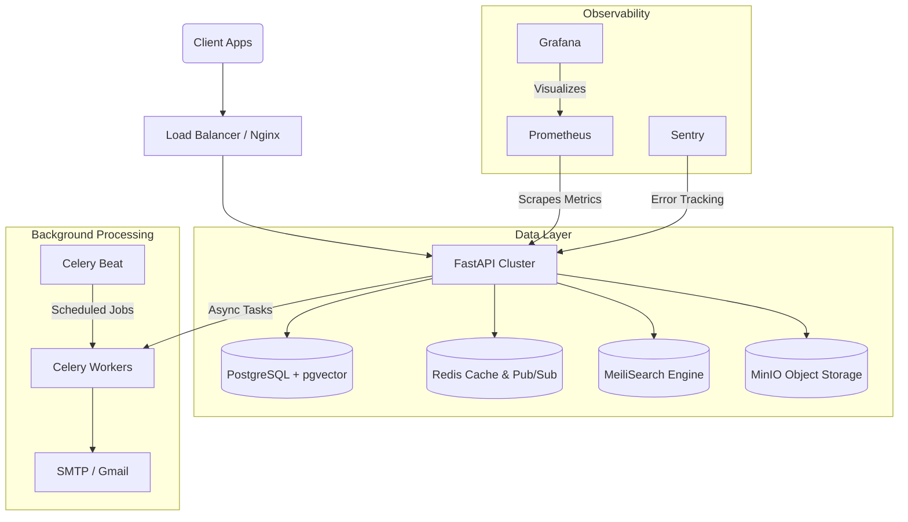

# FastFlix API 🎬

A progressive backend engineering project to build a production-grade Movie Recommendation Service.

This repository follows a strict 100-day "Deep Dive" roadmap, transitioning from Django patterns to high-performance FastAPI architecture.

## 🏗️ System Architecture

FastFlix is not just a CRUD API. It is a distributed system designed for scale.



## 🎯 Project Goals
- **Architecture:** Explicit Repository Pattern and Dependency Injection (moving away from "batteries-included" magic).
- **Performance:** Fully asynchronous I/O (AsyncPG, Redis) for high-concurrency handling.
- **Reliability:** Comprehensive testing suite (Pytest + HTTPX) with automated CI/CD pipelines
- **Scalability:** Event-driven background processing and real-time WebSocket broadcasting.
- **DevOps:** Containerized production environment (Docker Compose) with automated health checks.
- **Documentation:** Following a "Learning in Public" philosophy.

## 🛠 Tech Stack
- **Framework:** FastAPI
- **Language:** Python 3.11+ (AsyncIO) with `pgvector`
- **Database:** PostgreSQL 15 (Neon Serverless in Prod, Dockerized in Dev)
- **Search Engine:** MeiliSearch (Typo-tolerance & Hybrid Search)
- **ORM:** SQLAlchemy 2.0 (Async via `asyncpg`)
- **Migrations:** Alembic
- **Storage:** MinIO (S3 Compatible Object Storage)
- **Background Tasks:** Celery + Redis
- **Monitoring:** Prometheus & Grafana
- **Error Tracking:** Sentry
- **Admin Dashboard:** Streamlit
- **Testing:** Pytest, HTTPX, Pytest-Asyncio
- **CI/CD:** GitHub Actions (Linting & Automated Testing)
- **Containerization:** Docker & Docker Compose
- **Production Server:** Gunicorn with Uvicorn workers

---

## 🚀 How to Run

### 1. Local Development (Docker Compose)
The easiest way to get started is using Docker Compose, which handles the app and the database:

```bash
# Clone the repository
git clone [https://github.com/yourusername/fastflix-api.git](https://github.com/yourusername/fastflix-api.git)
cd fastflix-api

# Create your .env file
cp .env.example .env

# Start everything
docker-compose up --build
```

### 2. Manual Setup
```bash
# Create virtual environment
python -m venv .venv
source .venv/bin/activate

# Install dependencies
pip install -r requirements.txt

# Run migrations & start
alembic upgrade head
uvicorn app.main:app --reload
```

Visit docs at: `http://localhost:8000/docs`

## 🧪 Testing & CI/CD

This project uses a robust asynchronous testing suite and automated quality gates.
- **Local Testing:** Run `pytest` to execute the full suite.
- **CI Pipeline:** Every push to `main` triggers GitHub Actions to run:
  - **Ruff:** For lightning-fast linting and code formatting.
  - **Pytest:** To ensure zero regressions before deployment.

Run all tests:
```bash
pytest
```

Run with coverage report:
```bash
pytest --cov=app --cov-report=html tests/
```

Open `htmlcov/index.html` to view the coverage heatmap.


## 🎥 Core Features

### 🍿 Content Engine
- **Hybrid Search:** Combines `MeiliSearch` (typo-tolerance) and `PostgreSQL` (metadata) for sub-millisecond results.
- **Semantic Search (AI):** Vector embeddings (`pgvector`) allow users to search by meaning (e.g., "sad movies about space") rather than just keywords.
- **Recommendations:** "Trending Now" cache warmer and "More Like This" vector-based suggestions.
- **Smart Loading:** Optimizations like Select-in-Loading to prevent N+1 query problems.

### ⚡ Real-Time & Background

- **Live Notifications:** WebSockets broadcast "New Movie" alerts to all connected users instantly.
- **Async Emails:** Welcome emails and alerts are offloaded to Celery workers (non-blocking).
- **Scheduled Tasks:** Celery Beat runs weekly aggregation jobs to update the "Trending" cache.

### 📊 Observability & Operations
- **Metrics:** Real-time traffic, latency, and error rate monitoring via `Prometheus` & `Grafana`.
- **Tracing:** Full stack trace capture for production errors using `Sentry`.
- **Admin Dashboard:** A custom `Streamlit` interface for managing movies, users, and viewing analytics.

### 🔐 Security Features
- **Authentication (OAuth2):** Stateless JWT authentication (Access & Refresh tokens).
- **Authorization (RBAC):** Role-Based Access Control (Admin vs. User scopes).
- **Cryptography:** Passwords hashed via `bcrypt` (using `passlib`).
- **Dependencies:** `get_current_user` allows protecting routes with a single line of code.
- **Rate Limiting:** Redis-backed throttling (e.g., "5 login attempts per minute").
- **Hardening:** `TrustedHostMiddleware`, Rate Limiting (Redis), and strict Pydantic validation.


## 🗺️ Roadmap & Progress

✅ **Phase 1: The Foundation (Basics)**
- [x] **Structure:** Domain-driven layout (`api/`, `core/`, `services/`).
- [x] **Config:** Type-safe settings with Pydantic `BaseSettings`.
- [x] **Routing:** Modular `APIRouter` implementation.
- [x] **Validation:** Strict Pydantic schemas (Input vs Output models).

✅ **Phase 2: Architecture & Database**
- [x] **Database:** Dockerized PostgreSQL.
- [x] **ORM:** Asynchronous SQLAlchemy 2.0.
- [x] **Migrations:** Alembic version control.
- [x] **Pattern:** Repository Pattern (Service -> Repository -> DB).

✅ **Phase 3: Security & Auth**
- [x] **Auth Flow:** OAuth2 Password Bearer (JWT).
- [x] **Hashing:** Secure password storage using `bcrypt`.
- [x] **Authorization:** Row-level security (Users manage only their own data).
- [x] **Relationships:** One-to-Many logic (User -> Movies) enforced via Foreign Keys.

✅ **Phase 4: Reliability & Testing**
- [x] **Test Harness:** Configured `pytest-asyncio` for Windows/Linux compatibility.
- [x] **Fixtures:** Modular `conftest.py` with transaction rollbacks and data cleaning.
- [x] **Integration Tests:** End-to-end API testing using `httpx.AsyncClient`.
- [x] **Unit Tests:** Isolated Service layer testing.
- [x] **Coverage:** Automated reporting with `pytest-cov`.

✅ **Phase 5: DevOps & Deployment**
- [x] **Dockerization:** Optimized multi-stage Dockerfile.
- [x] **Process Management:** Production-ready Gunicorn configuration.
- [x] **CI/CD:** Fully automated GitHub Actions pipeline.
- [x] **Cloud Migration:** Deployed to Railway with Neon Postgres (SSL enforced).

✅ **Phase 6: Advanced Logic & Performance**
- [x] **Watchlists:** Many-to-Many relationships implementation.
- [x] **Recommendations:** SQL-based collaborative filtering algorithm.
- [x] **Background Workers:** Celery + Redis for async tasks (Emails).
- [x] **Rate Limiting:** FastAPI Limiter with Redis backend.
- [x] **Model Optimization:**
    - Native PostgreSQL Search Vectors (TSVector + GIN Index).
    - Denormalized Ratings for O(1) read performance.
    - SEO-friendly Slugs & Audit Timestamps.
    - Async CLI Data Importer with Genre Mapping.

✅ **Phase 7: Real-Time & Workers**
- [x] **WebSockets:** Live notification broadcasting.
- [x] **Celery Workers:** Background email delivery.
- [x] **Celery Beat:** Scheduled cache warming (Trending Movies).
- [x] **Redis Pub/Sub:** Event-driven messaging.

✅ **Phase 8: Observability & Monitoring**
- [x] **Structured Logging**: You can search JSON logs (`structlog`).
- [x] **Tracing:** You can see waterfall graphs of slow requests (`Sentry`).
- [x] **Metrics**: You can see real-time traffic charts (`Prometheus` + `Grafana`).
- [x] **Alerting:** You know when things break (`AlertManager`).

✅ **Phase 9: Security Hardening**
- [x] **Security Headers**: Middleware hardening (Strict CORS, HSTS, X-Content-Type).
- [x] **Rate Limiting**: DDoS protection with `Redis` & `SlowAPI`.
- [x] **Data Hardening**: SQL Injection prevention & `Pydantic` strict mode.
- [x] **Auth Refinement**: Dual-token system (JWT Access + Refresh Tokens).

✅ **Phase 10: Advanced Authentication**
- [x] **Social Login**: Google OAuth2 integration (`Authlib`).
- [x] **RBAC Data Layer**: Roles & Permissions database models.
- [x] **RBAC Enforcement**: Declarative dependencies (`movie:delete`).
- [x] **Permission Seeding**: Automated script for default roles.

✅ **Phase 11: Scale & Search**
- [x] **Search Engine**: MeiliSearch integration (Typo-tolerance & Ranking).
- [x] **Hybrid Search**: Logic to switch between SQL & Search Engine.
- [x] **Real-Time Sync**: Background tasks for instant index updates.
- [x] **DB Tuning**: Query analysis (`EXPLAIN ANALYZE`) and Index optimization.
- [x] **Caching Strategy**: Redis Cache-Aside pattern for high-traffic reads.

✅ **Phase 12: AI & Semantic Search**
- [x] **Vector Database**: Enable `pgvector` & update Movie models.
- [x] **Embedding Pipeline**: Generate vector embeddings for Movie descriptions (HuggingFace).
- [x] **Semantic Search**: Implement "Search by Meaning" endpoint (Cosine Similarity).
- [x] **Recommendations**: "More Like This" engine based on vector distance.
- [x] **RAG**: "Chat with your Data" endpoint using a local LLM.

✅ **Phase 13: The Admin Dashboard**
- [x] **UI Framework**: Set up `Streamlit` for a Python-only frontend.
- [x] **Analytics**: Visualize User Growth and Genre Popularity charts.
- [x] **Movie Manager**: GUI to Add/Edit/Delete movies without using Postman.
- [x] **AI Playground**: Visual tool to test Semantic Search results.

✅ **Phase 14: The Final Stretch (Days 97-100)**
- [x] **Container Registry**: Push optimized images to Docker Hub (`rmusayevr/fastflix`).
- [x] **CI/CD Pipeline**: GitHub Actions for automated testing and image building.
- [x] **Production Hardening**: Security config sanitization and email TLS encryption.
- [x] **Documentation**: OpenAPI metadata, tags, and professional descriptions.
- [x] **Final Release**: Tagged `v1.0.0`, smoke-tested, and live.

## 📂 Project Structure
```
fastflix-api/
├── .github/            # CI/CD Pipelines (GitHub Actions)
├── alembic/            # Database Migrations (Version Control)
├── app/
│   ├── api/            # Routes & Endpoints (v1)
│   ├── core/           # Config, Security, OAuth, Celery & Exceptions
│   ├── dashboard/      # Streamlit Admin Dashboard
│   ├── db/             # Database session & Base models
│   ├── models/         # SQLAlchemy Tables (Movies, Users, Ratings, RBAC)
│   ├── repositories/   # DB Access Layer (Repository Pattern)
│   ├── schemas/        # Pydantic Models (Request/Response)
│   ├── services/       # Business Logic Layer
│   ├── tasks/          # Background Workers (Celery + Redis)
│   ├── templates/      # Jinja2 Templates (Emails)
│   ├── utils/          # Utility functions (Storage, Helpers)
│   └── main.py         # Application Entrypoint (Instrumented)
├── prometheus/         # Monitoring Configuration
│   ├── alert_rules.yml # Alert definitions (High Latency, Errors)
│   └── prometheus.yml  # Prometheus scrape config
├── scripts/            # Management CLI & Data Importers
├── static/             # Mounted static assets (Exports/Images)
├── tests/              # Pytest Suite (Unit, Integration, Load)
├── Dockerfile          # Multi-stage production build
├── docker-compose.yml       # Dev Orchestration
├── docker-compose.prod.yml  # Production Orchestration
├── gunicorn_conf.py    # Production Process Manager config
├── prestart.sh         # Migration & startup automation script
└── requirements.txt    # Dependencies
```

**Live Demo:** https://fastflix-api-production.up.railway.app/docs